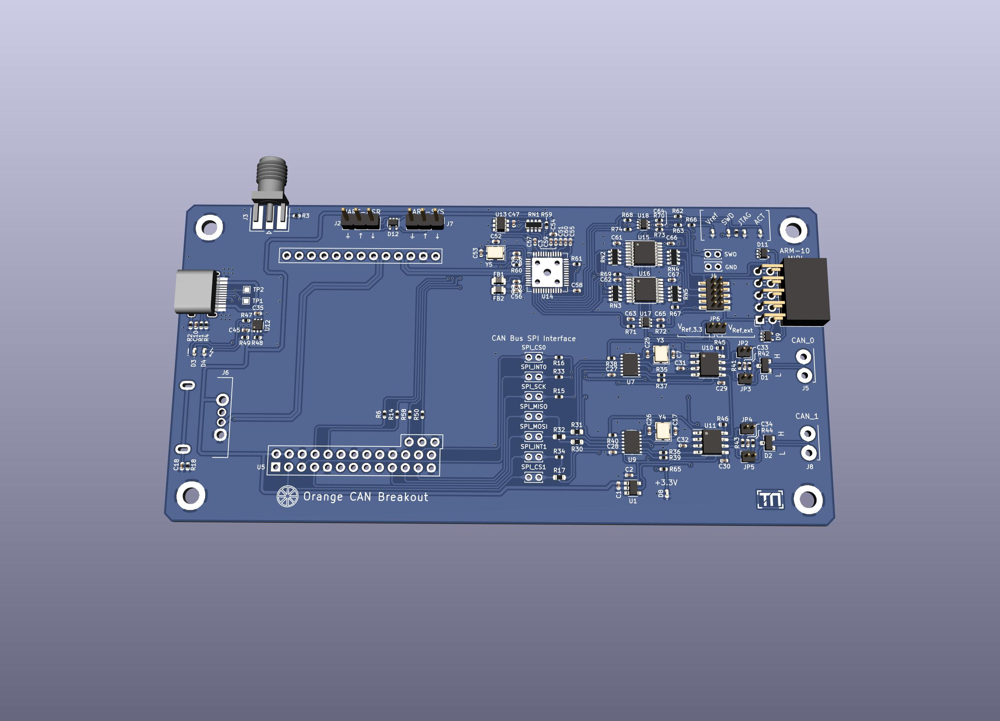
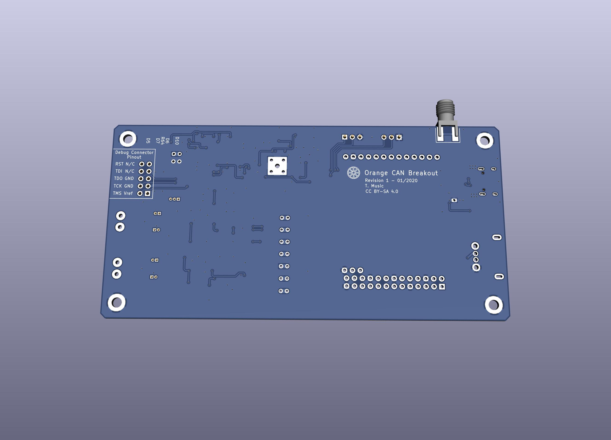

# Orange PI CAN Breakout
[](https://creativecommons.org/licenses/by-sa/4.0/)

T. Music - 01/2020

## Project Status

```
PCB Design Complete - Next up is assembly and testing
```

## Introduction

Some time ago I had ordered myself a Raspberry Pi Zero with the intention to use it as a wireless debugger. The performance of it and the system in general however did not live up to my expected standards, so I had decided to give another single board computer a shot. The requirements whilst picking were easy integreatibility (USB on pinheaders), sufficiently high computational power (something the rpi zero somewhat lacked) and naturally - WiFi. In the end the Orange Pi Zero Plus 2 (Allwinner H5 core) won and was ordered.

On top of that I thought about extending the capability of said system through optional modules, which can be addressed through a python api running on the orange pi. One criteria was to provide somewhat sufficient data rate for hobbyist use cases and to keep the hardware overhead low. After reading through a few bus systems and protocols I reached the decision to use CAN bus. Cheap controllers by ST have already CAN controllers built in and require only a transceiver in the range of a few cents. These STM32 support data rates up to 1 Mbit/s, enough for small amounts of measurement data as well as control messages.
If one needs higher data rates, the CAN FD standard increases the message's data bitrate to up to 8 Mbit/s. Whilst CAN FD is backwards compatible to regular CAN, upwards compatibility is not given, therefore legacy and FD nodes should not be mixed on one bus.

## Description
< write me >

## Design Notes

Only wanted one distributor. Due to my previous positive experiences, I again went for LCSC.  
With the design finalised, the PCB was sent off to JLCPCB.

## Schematic
Click here to open the [Schematic Revision 1](Production_Data_Rev_1/can_breakout_pcb_rev1.pdf).

## Renders

### Front


### Back


